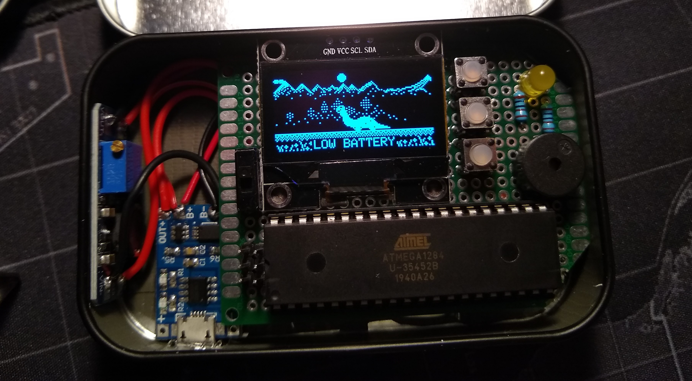

/* ===================
 
  TAMAGUINO (MEGA VERSION)
  v0.99 December 10th, 2019
  https://github.com/SandwichRising/Tamaguino-Mega/
 
  Compiled using Arduino IDE 1.8.10 and MightyCore by MCUdude v2.0.3 board library (for ATmega1284 use)
  
  Based entirely off jakob's tamaguino code @ https://alojzjakob.github.io/Tamaguino/
 
  This is still a WIP program, but far enough along to take a break
  and have a complete-feeling project. I used .h extensions to create support files to make it easy to work with in Arduino IDE, 
  I know it's not exactly c++ convention to stick everything into .h files like I did but it worked well for this project.
  
  Known Issue: there is (literally) junk art data added in to fix 
  some sort of pointer-related issue with art frames. Removing the
  junk art (with parts located in tamaguinoArt.cpp, tamaguinoArt.h and the evolve()
  function in miscFunctions.cpp) causes one art frame to be distorted in the adult
  evolution animations. Adding different amounts of junk art frames and art sets moves the single 
  distorted frame around, between the different adult skins and array locations. Adding the current
  amount moves it out beyond the real art arrays (apparently) and displays all art normally.
  
  All the art assets used in the program are found in the images_used folder, with new adult dino skins also having a .cpp file with
  the hex arrays.
 
  Uses Additional Libraries:
  Adafruit_GFX (only version 1.1.5 due to I2C speed issues)
  Adafruit_SSD1306 (only version 1.1.2 due to I2c speed issues)
  Adafruit_SH1106 (unofficial, @ https://github.com/wonho-maker/Adafruit_SH1106)
  ==================== */
  
  This version will not fit on an ATmega328P (Aduino UNO) and requires a chip with 48kb flash, 4kb of SRAM, and 64 bytes of EEPROM. I have been primarily using an ATmega1284, but other chips shoud work as well, such as Arduino Megas and hopefully ATmega4809's. The graphics library versions are important, especially when running an I2C screen, as newer libraries make the program work much slower than intended. If you use this, please send some feedback, I would be interested in hearing.
  
New features with Mega version:
* 3 adult evolutions - One is randomly picked when your pet has been alive long enough (2 days currently).
* EEPROM saving - No more losing your pet due to power out. Saves 4 times a day automatically plus a manual option.
* Pet Names - Name your pet at the start of a new game.
* Screen auto-dims (or not) after a set amount of time, saves battery, and timeout can be changed in settings (or disabled)
* Battery Meter and Low Battery Detection - Needs power level detection adjusted for new types of batteries, currently has Samsung 18650's and 2-wire Protected LiPo Batter Packs added (tuned using a 1200mAh PL633450).
* Stats reworked and go down at different rates based off pet age and if it's evolved or not. Doctor removed, cleaned area causes health to increase, poop causes gradual decrease.
* Sounds in the program are easier to queue through a function to make tones or even songs when working in the program.
* Program is controlled by a top FPS, so faster setups (SPI screens) run the game at the same rate as I2C (~13 FPS)
* milli() based delays instead of delay(), speeds up program and prevents 'button lag'.
* Code reorganization (for better or worse) and plug-and-play menu system (just add the menu item to the mainMenu array and define actions/settings by name below without changing any structure)
